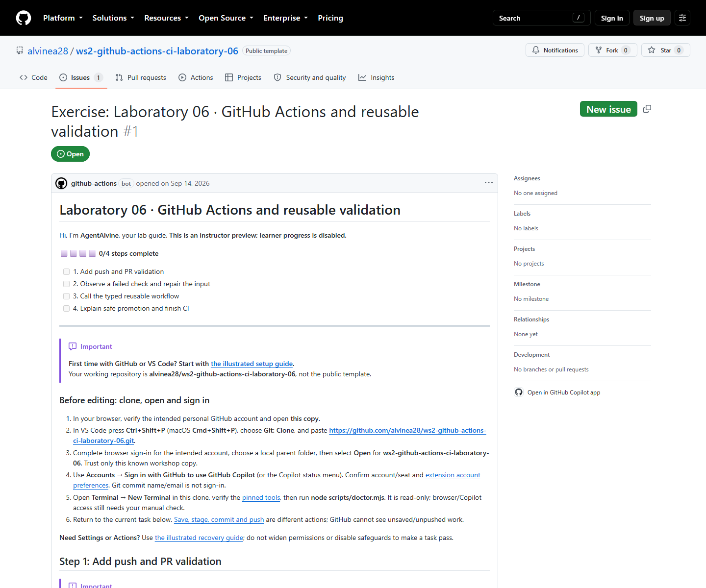

# Lab 06 · Full workshop content for review

## Learner-created workflows

This lab deliberately asks the learner to **create** the ordinary lab-checks
workflow in Activity 01 and the reusable validation workflow in Activity 03.
Those files do not exist in the untouched source template. In this review copy,
their lesson links lead here instead of a nonexistent GitHub file; the commands
and complete lesson text are unchanged. Follow the supplied starter code in
[Activity 01](activity-01.md) and [Activity 03](activity-03.md) in your own copy.
The reference implementations are under [solutions](../solutions/).
Do not install completed workflows into the public starter merely to fix a link.

[Repository landing](../README.md) · [Complete setup](00-start-here.md) · [Azure inputs and login](azure-setup.md) · [Simulation and verification](simulation.md)

**Static review pack**, not another Exercise. Marked lessons match canonical text, rebasing only Markdown links outside code fences; complete examples and attribution remain intact.

**Additional hands-on:** [Defender DevOps: scan, inspect, repair and rescan](defender-devops-hands-on.md), the full guide with rebased links. Separate Azure/connector authorization is required; this unexecuted source activity adds no historical A/B proof or automatic grade.

## Learner route: one copy, one Exercise

1. Complete [account/install/copy/clone/open setup](00-start-here.md) once; reuse your own copy and URL.
2. Open **your copy's Exercise**. **Save → stage → commit → push → refresh the same Exercise** ([Git guide](../docs/git-workflow.md)); AgentAlvine updates it from real events.
3. Keep the PR draft through real red → repaired green CI and nested validation. No merge/deployment needed; never fabricate runs or pre-fill success.

**Stop/recover:** [missing Exercise](../docs/troubleshooting.md#agentalvine-or-the-exercise-is-missing); never widen permissions or fabricate progress. PR checks stay credential-free. Optional [Azure inputs](azure-setup.md#1-find-the-three-values-before-opening-the-terminal)/[login](azure-setup.md#4-reuse-an-existing-login-or-sign-in-when-required) do not replace protected live approvals.

## Complete activity sequence and original A/B status

Both original cycles were run on **2026-09-08**. “Verified” refers to the corresponding original private Exercise checkpoint, not completion in a new learner copy or the public source.

| Activity | Complete lesson | Cycle A | Cycle B |
| --- | --- | --- | --- |
| Setup | [Full first-time setup](00-start-here.md) | Guidance; not a progress checkpoint | Guidance; not a progress checkpoint |
| 01 | [Add push and PR validation](activity-01.md) | Verified | Verified |
| 02 | [Observe a failed check and repair the input](activity-02.md) | Verified — real red → green | Verified — real red → green |
| 03 | [Call the typed reusable workflow](activity-03.md) | Verified — actual nested CI | Verified — actual nested CI |
| 04 | [Explain safe promotion and finish CI](activity-04.md) | Verified — offline complete | Verified — offline complete |

**Original progress: A 4/4; B 4/4.** Promotion remained a credential-free design exercise. See [simulation.md](simulation.md) for whole-lab counts and the private original red/green and nested-run sources.

## Live public source preview — read-only, not learner progress

The **2026-09-14 observation** confirmed [public source Exercise #1](https://github.com/alvinea28/ws2-github-actions-ci-laboratory-06/issues/1) in successful instructor Preview, **step 0 (0/4)**—not learner progress or a new simulation.

*Actual public Preview capture, 2026-09-14; not a September 8 participant screenshot. [images/provenance.json](images/provenance.json) retains its timestamp and PNG SHA-256.*

[2026-09-14 local verification](simulation.md#fresh-2026-09-14-verified-results) is separate from learner progress. [Private Lab 06 originals](https://github.com/alvine-aurelio-org/ws2-public-rebuild-20260908-evidence/blob/dev/full-ws-content/lab-06/README.md) retain red/green and nested-run records; screenshots do not replace them.

[Course manifest](../.github/agentalvine/course.json) · [Independent laboratory catalogue](https://github.com/alvinea28/ws2-workshop-catalogue)
