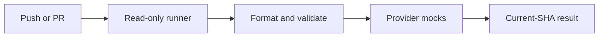
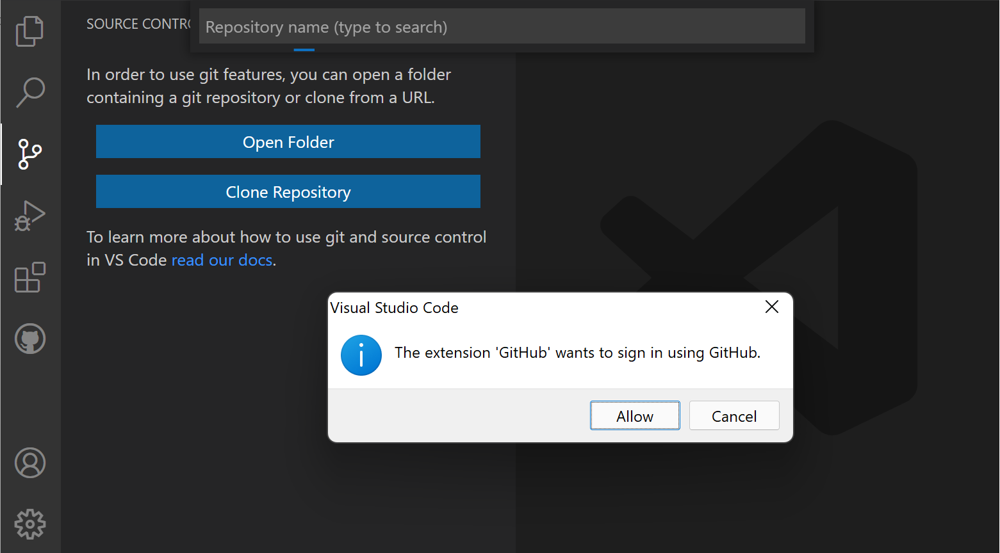

# Lab 06 · Activity 01 — Add push and PR validation

[Review index](README.md) · [Setup](00-start-here.md) · [Next activity](activity-02.md) · [Simulation evidence](simulation.md)

> [!NOTE]
> **Review copy, not a second progress tracker.** The complete canonical lesson follows. Learners follow the live **Exercise issue in their own private copy**, opened from that copy's README; AgentAlvine updates the same issue body. The public source preview awards no learner progress.

<!-- FULL-WS-LESSON:START -->
# Lab 06 · Step 1 — Add credential-free push and PR checks

**Goal:** add actual push/PR checks and open a draft PR. This independent lab supplies its complete module, security child, locks, mocks and starters; no earlier release or Azure account is needed.

| Working context | Value |
| --- | --- |
| Branch | Updated actual default, normally `dev` → `lab/ci` for all four steps |
| Starter | [exercises/lab-checks.yml.example](../exercises/lab-checks.yml.example) |
| Create | [.github/workflows/lab-checks.yml](README.md#learner-created-workflows) |
| Inspect | [module/main.tf](../module/main.tf), [module/tests/network.tftest.hcl](../module/tests/network.tftest.hcl), [scripts/check-learner.mjs](../scripts/check-learner.mjs) |
| Tools | Node **24.16.0**, Terraform **1.16.1**, AzureRM **5.4.0**; mocks only |



Flow: push/PR → read-only runner → format/schema checks → mocks → current-revision result. Failure stops validation; success does not authorize deployment.

## Do 1 — Open your copy and check readiness

Already in your copy or its Exercise? **Do not copy again.** Otherwise use [one-time account/install/copy/clone setup](../docs/start-here.md). Open your own HTTPS clone in desktop VS Code, not the source template or parent folder. Check Git authorship and Copilot account/seat separately. In **Terminal → New Terminal** at the clone root:

```powershell
node scripts/doctor.mjs
```

**Why:** Node runs the read-only readiness script, with no flags; local tools/copy checks do not prove browser login, push rights, Copilot entitlement or Azure readiness. **Expected:** no unresolved errors. **Stop** on missing tools/wrong root and use [toolchain help](../docs/toolchain.md).



*REFERENCE — Microsoft publisher example, CC BY 3.0 US; not proof of your sign-in. [Sources and attribution](../docs/images/NOTICE.md).*

## Do 2 — Create the branch and complete workflow

Follow [shared pull/branch steps](../docs/git-workflow.md) to create `lab/ci`. Copy the **whole starter** into the listed destination using **Explorer → New File**; inspect an existing destination before replacing it. Preserve this complete workflow:

```yaml
name: Lab checks
on:
  push:
  pull_request:
permissions:
  contents: read
jobs:
  validate:
    name: Validate learner code
    runs-on: ubuntu-24.04
    steps:
      - uses: actions/checkout@3d3c42e5aac5ba805825da76410c181273ba90b1 # v7.0.1
        with:
          persist-credentials: false
      - uses: actions/setup-node@820762786026740c76f36085b0efc47a31fe5020 # v7.0.0
        with:
          node-version: 24.16.0
      - uses: hashicorp/setup-terraform@dfe3c3f87815947d99a8997f908cb6525fc44e9e # v4.0.1
        with:
          terraform_version: 1.16.1
          terraform_wrapper: false
      - run: node scripts/check-learner.mjs
```

| Element / command | Why it is here |
| --- | --- |
| `push`, `pull_request` | Validate branch pushes and PR changes |
| `contents: read`, `ubuntu-24.04` | Read-only repository token on a GitHub-hosted runner |
| Full `uses` SHAs | Pin action code; do not replace them with movable tags |
| `persist-credentials: false` | Do not retain checkout authentication for later Git commands |
| `node-version`, `terraform_version` | Select the exact supplied tools |
| `terraform_wrapper: false` | Use Terraform directly so the helper receives its actual JSON/output |
| `node scripts/check-learner.mjs` | Run the JavaScript checker from the repository root, with no flags |

No Azure login/OIDC/state, `id-token: write`, `secrets.`, `secrets: inherit`, `pull_request_target:`, private runner or broader token permissions belong in PR validation.

## Do 3 — Save and run the same local check

```powershell
node scripts/check-learner.mjs
```

**Why:** Node runs the same helper locally, from the clone root, with no flags. It removes cloud credential variables from Terraform's environment and requires mock-only plan tests. Its internal Terraform operations are:

| Internal command/option | Meaning |
| --- | --- |
| `-chdir=module` | Select the supplied module root, not arbitrary caller input |
| `fmt -check -recursive` | Check formatting without rewriting; include nested directories |
| `init -backend=false -lockfile=readonly -input=false -no-color` | Prepare dependencies without backend access, lock changes, prompts or colour |
| `validate -no-color` | Validate configuration/schema with plain-text diagnostics |
| `test -json -no-color` | Execute mocks and parse machine-readable results, without colour |

**Expected:** required cases execute and pass. Provider downloads may need internet; no Azure access occurs. **Stop** on formatting/validation errors, credentials, or zero/skipped/failed/errored tests; do not weaken checks. Copilot **Ask** can explain the workflow read-only, not replace verification.

## Do 4 — Push and open the draft PR

Review the workflow-only diff. **Save → stage → commit → push → refresh the same Exercise** using the [Git guide](../docs/git-workflow.md); message: `lab: add credential-free CI`. First push: **Publish Branch → existing origin**.

Inspect **Actions → Lab checks → Validate learner code** at the newest `lab/ci` SHA. Open a **same-copy** PR, base actual default → compare `lab/ci`, titled **Build credential-free CI**; select **Create draft pull request**. Explain that the deliberate failure comes next; keep the PR draft and never merge that red revision.

**Expected:** published workflow, actual run and draft PR. AgentAlvine checks this step's workflow files; later tasks require successful current CI.

**Stop/recover:** check destination/branch for missing runs; fix YAML indentation for parse errors. For policy blocks or a missing/stale Exercise, inspect **AgentAlvine** and [troubleshooting](../docs/troubleshooting.md); never widen permissions or fabricate progress.
<!-- FULL-WS-LESSON:END -->

## Original Cycle A/B outcome — 2026-09-08

- **Cycle A: verified.** The credential-free push/PR workflow checkpoint was accepted in the original private copy.
- **Cycle B: verified.** The fresh private copy independently passed the same workflow checkpoint with read-only permissions and pinned tools.
- This establishes the CI activity, not GUI authorization, a Copilot seat, or an Azure permission grant. Both cycles later completed **4/4** activities.

See [simulation.md](simulation.md) for the private immutable records and original run URLs. Test counts are whole-lab totals, not assigned to this activity.

[Review index](README.md) · [Next activity](activity-02.md)
