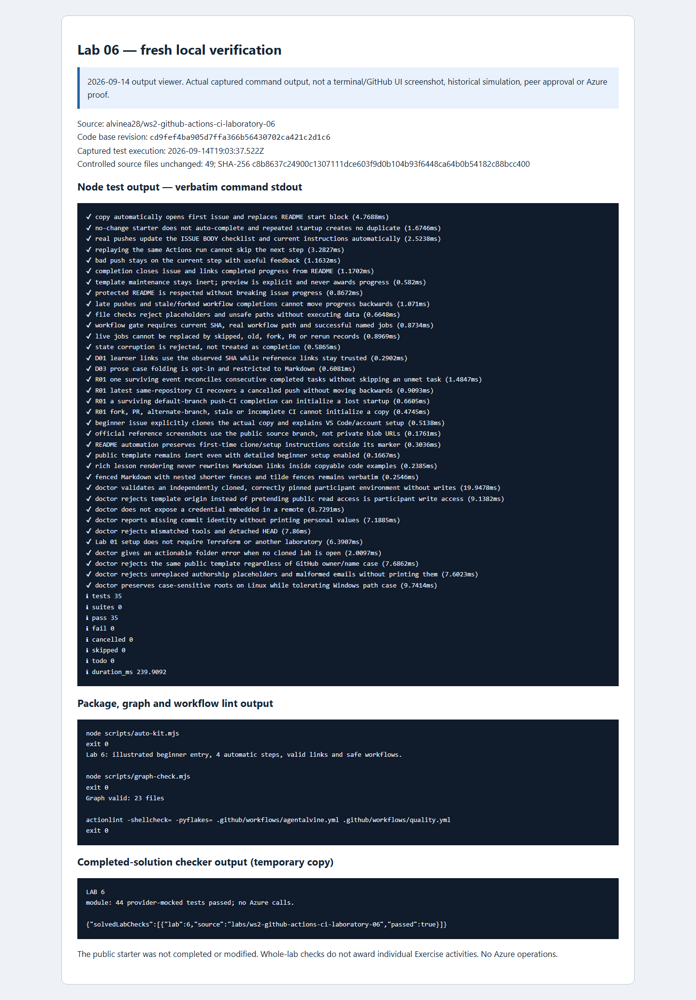

# Lab 06 · Original simulation evidence and new review captures

[Review index](README.md) · [Complete setup](00-start-here.md) · [Repository landing](../README.md)

## Dates and evidence scope

- **Original Cycle A: 2026-09-08. Original Cycle B: 2026-09-08.** These were separate fresh private learner copies, not the public source preview.
- **New review/capture date: 2026-09-14.** Fresh local checks passed and the review images were captured; neither is a third participant cycle. Results and PNG provenance are recorded separately below.
- A read-only GitHub observation rechecked the original private completion arrays and immutable CI bindings without changing progress. It separately confirmed the successful public source **Exercise #1** instructor Preview at **step 0, with 0/4 participant progress**. A successful source Preview is not learner CI or completion.
- Primary proof and source URLs: [private Lab 06 review](https://github.com/alvine-aurelio-org/ws2-public-rebuild-20260908-evidence/blob/dev/full-ws-content/lab-06/README.md). Use its original immutable commits, private Exercise records, deliberate-red and repaired-green Actions links, and nested-CI job/run links. Public source quality checks are not substituted for those participant runs.
- The [original public summary](../docs/daily%20work%20report/2026-09-08.md) records the published per-lab totals. Raw private logs are not copied into this public pack.

## Per-activity original outcomes

| Activity | Cycle A | Cycle B | What was established |
| --- | --- | --- | --- |
| [01 · Push and PR checks](activity-01.md) | Verified | Verified | Credential-free workflow checkpoint accepted with pinned tools and read-only permissions. |
| [02 · Genuine failure and repair](activity-02.md) | Verified | Verified | Actual invalid-CIDR red revision followed by corrected green revision and diagnosis note. |
| [03 · Typed reusable workflow](activity-03.md) | Verified | Verified | Actual job-level reusable invocation and nested CI, not merely a reusable filename. |
| [04 · Promotion decisions and current CI](activity-04.md) | Verified | Verified | Honest promotion note plus successful current-revision caller; offline course complete. |

Both private guides reached **4/4**. No offline learner blocker remained observed. A merge, Lab 07 completion, or live environment was not required for this course's completion gate.

## Original red → green and nested-CI proof

The original cycles deliberately placed `10.300.0.0/16` in the valid topology case, observed actual validation failure, and restored `10.42.0.0/16` without weakening validation or permanent negative tests. The compact diagnostic may omit the raw value or test name: use the **exact failed revision together with its diagnostic**, not a claim that omitted text appeared in a log.

The typed reusable caller was then exercised through real nested validation. The [private evidence review](https://github.com/alvine-aurelio-org/ws2-public-rebuild-20260908-evidence/blob/dev/full-ws-content/lab-06/README.md) provides the source run URLs and revisions for both cycles. Its records, not a new screenshot or the current public preview, establish these historical transitions. The current note-plus-success gate is narrower than forensic proof of a historical red run.

## Original test accounting — whole lab, not per activity

| Original cycle | Lab 06 progress | Node passes | Mocked case + fixture passes |
| --- | --- | --- | --- |
| A · 2026-09-08 | 4/4 | 32 | 44 |
| B · 2026-09-08 | 4/4 | 35 | 44 |

These totals belong to each **whole-lab cycle**, not each activity, commit, or CI rerun. The intentional red run is expected failure evidence, not an extra passing suite.

Across **all eight labs**, each original cycle reached **25/33 activities** with **five complete laboratories**. Cycle A recorded **301 Node** passes; Cycle B recorded **325 Node** passes. Each recorded **229 mocked case/fixture passes, excluding repeats**. These historical totals are not fresh 2026-09-14 results.

## Legitimate rejection coverage and limits

These boundaries are grounded in the [current course configuration](../.github/agentalvine/course.json) and canonical lessons. Except for the explicitly recorded original red-to-green experiment, this table describes required rejection behavior; it **does not claim every listed rejection was freshly executed or manually attempted in each learner copy**.

| Boundary | Rejected or insufficient evidence | Grounding |
| --- | --- | --- |
| Credential-free workflow | Missing push/PR declarations or pins, unfinished `TODO`, `id-token: write`, `secrets.`, secret inheritance, or `pull_request_target:` | [Activity 01](activity-01.md) and manifest file checks |
| Intended CIDR failure | Invalid `10.300.0.0/16` in the valid scenario; YAML/tool/download failures do not prove this diagnostic | [Activity 02](activity-02.md); original red/green evidence remains private |
| Honest repair | Removing assertions, adding `expect_failures` to the valid run, or hiding failure with `continue-on-error` | Activity 02 teaching requirement; note text alone cannot prove compliance |
| Reusable interface | Missing required string `root`, wrong caller shape, or a value other than `module`; arbitrary paths/shell fragments fail the supplied quoted allowlist | [Activity 03](activity-03.md) and supplied workflow contract |
| Final completion | Missing promotion phrases, stale green SHA, skipped/empty tests, a setup-only green job, or a separate unused reusable workflow | [Activity 04](activity-04.md); whole current caller must succeed |

Mocks and file/CI gates do not verify live OIDC, RBAC, state, networking, or independent deployment approval. No controls were weakened for this documentation.

## Fresh 2026-09-14 verified results

Source-quality checks and the real completed-solution fixture checker passed, with the solution exercised in an isolated **temporary copy**. The pinned workshop toolchain was Terraform **1.16.1**, AzureRM **5.4.0**, and terraform-docs **0.24.0** for documentation checks. No Azure operations occurred.

| Check | Result |
| --- | --- |
| Node tests | 35 passed; 0 failed; 0 skipped |
| auto-kit | Passed |
| graph | Passed |
| actionlint | Passed |
| Completed-solution checker | Passed — isolated temporary copy |

These are fresh whole-lab checks, not per-activity proof or new mock totals. The [fresh command record (organization access required)](https://github.com/alvine-aurelio-org/ws2-public-rebuild-20260908-evidence/blob/dev/evidence/review-2026-09-14/local/lab-06.json) is separate from the original A/B records; their progress and counts are unchanged. These local checks do not replace the original red/green and nested CI bindings.

## Screenshots: distinguish observation from reconstruction

Original step-by-step browser screenshots **were not taken on 2026-09-08**. Private activity images were captured on **2026-09-14** from a labelled local viewer of preserved original records, **not original-day GitHub UI**. The [source preview image](README.md#live-public-source-preview--read-only-not-learner-progress) is a separate actual public GitHub capture of read-only Exercise #1 at step 0 (0/4), not either learner cycle's CI run.

*Captured on 2026-09-14 from a labelled local output viewer of the actual fresh commands, including the completed-solution fixture check in a temporary copy. This is not terminal UI, historical GitHub UI, a third participant cycle, or human/live approval. [images/provenance.json](images/provenance.json) records both public PNG SHA-256 digests and exact capture timestamps.*

Screenshots are secondary to original immutable records and actual Actions runs in the [private review](https://github.com/alvine-aurelio-org/ws2-public-rebuild-20260908-evidence/blob/dev/full-ws-content/lab-06/README.md). Publisher reference screenshots retain their original attribution and are not simulation captures.

## Remaining work and non-claims

- Both original offline cycles completed; the September 14 captures and fresh local checks are separate review evidence, not another participant cycle.
- Promotion to another environment remains a design discussion, not a deployed test/staging/production environment. No Azure/OIDC/state access was needed.
- No GUI sign-in, MFA completion, Copilot-seat assignment, human approval, or cloud success is inferred from test automation.
- No Azure deployment, identity creation, state access, subscription change, or live cloud run occurred in this documentation work. Cloud health is **not tested**.
